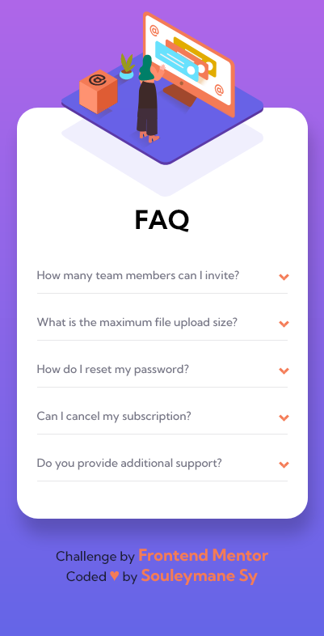
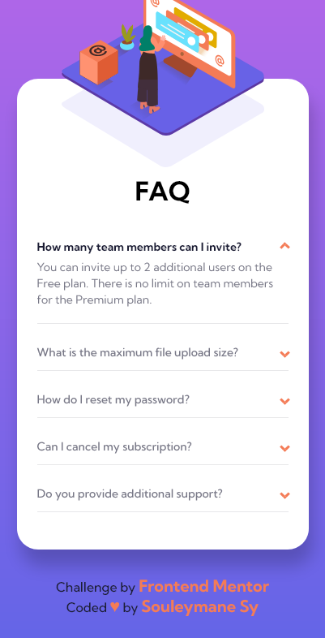
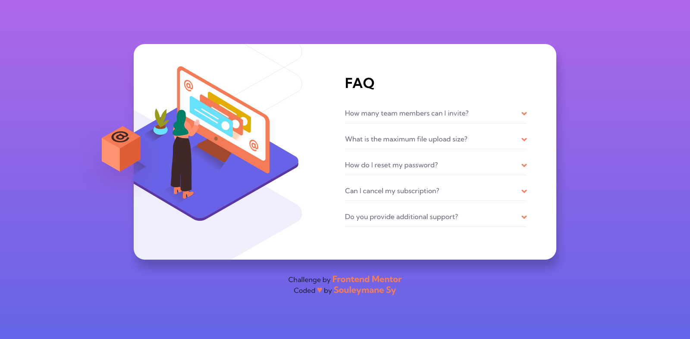

# Frontend Mentor - FAQ accordion card

## Welcome! 👋

Thanks for checking out this front-end coding challenge.

This is a solution to the [FAQ accordion card challenge on Frontend Mentor](https://www.frontendmentor.io/challenges/faq-accordion-card-XlyjD0Oam).

[Frontend Mentor](https://www.frontendmentor.io) challenges help you improve your coding skills by building realistic projects.

## The challenge

Your challenge is to build out this FAQ accordion card and get it looking as close to the design as possible.

You can use any tools you like to help you complete the challenge. So if you've got something you'd like to practice, feel free to give it a go.

Your users should be able to:

- View the optimal layout for the component depending on their device's screen size
- See hover states for all interactive elements on the page
- Hide/Show the answer to a question when the question is clicked
- **Bonus**: Complete the challenge without using JavaScript

### Screenshot

This is the Screenshot of the projects a made!

### Mobile

### Mobile Active

### Desktops

### Links

- Solution URL: [solution URL here](https://www.frontendmentor.io/solutions/responsive-faq-accordion-card-made-with-only-html-and-css-ugpULzSCKu)
- Live Site URL: [live site URL here](https://fem-faq-accordion-card-ten.vercel.app/)

## My process

Made this projects with ONLY HTML5 and CSS !!!

### Built with

- Semantic HTML5 markup
- SASS
- CSS custom properties
- Flexbox
- Mobile-first workflow
- npm

## Author

- GitHub - [Souleymane Sy](https://github.com/SouleymaneSy7)
- Frontend Mentor - [@SouleymaneSy7](https://www.frontendmentor.io/profile/SouleymaneSy7)
- Twitter - [@Souleymanesy43](https://twitter.com/Souleymanesy43)
